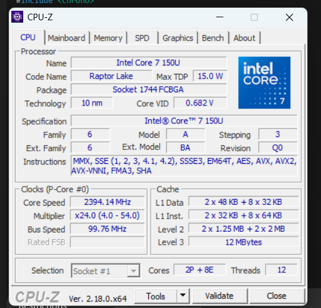
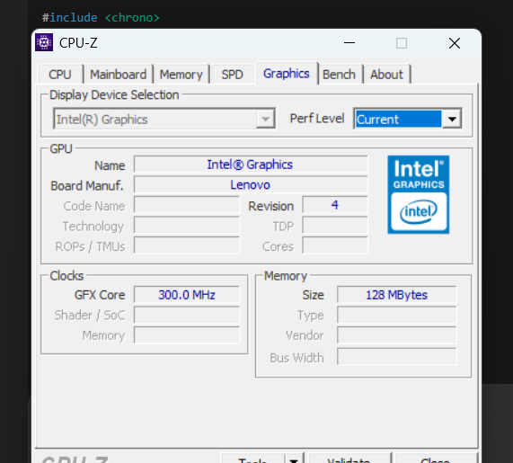
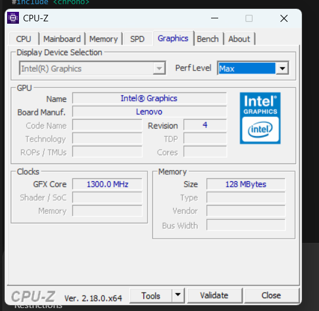
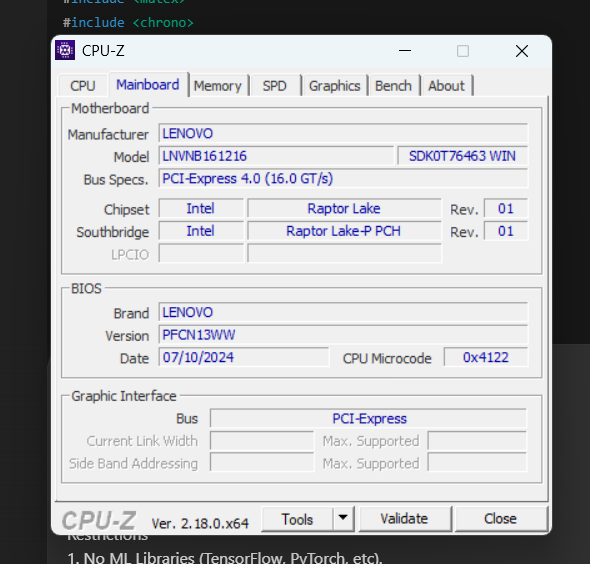
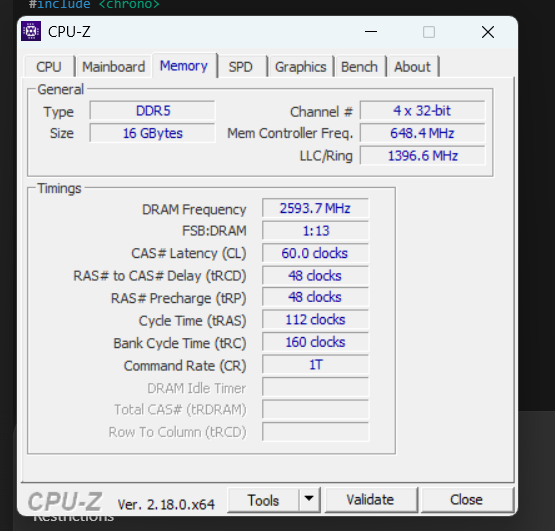
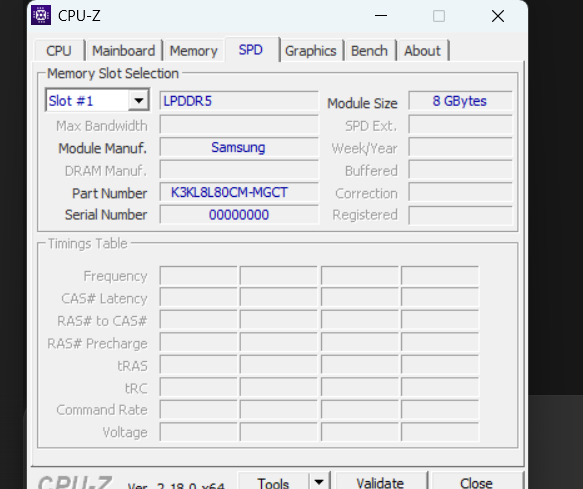
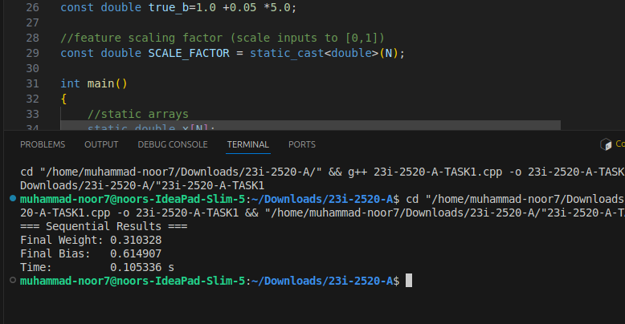
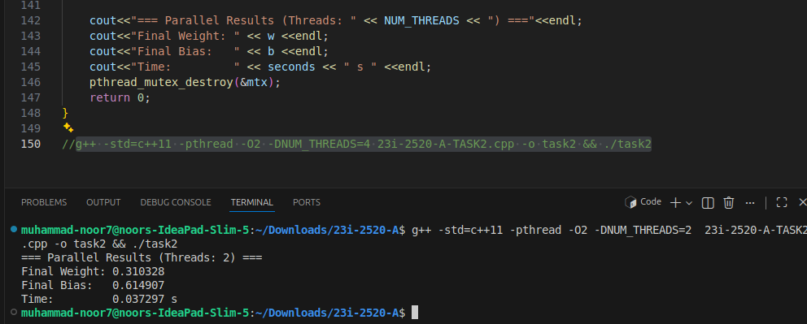
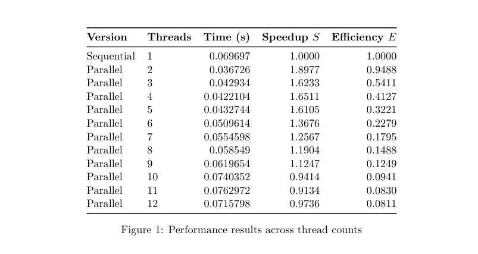

# Parallel Gradient Descent Linear Regression

## Project Overview

This repository contains a complete implementation of **linear regression using batch gradient descent** in both **sequential** and **parallel** forms. The sequential version is the baseline, while the parallel version uses **POSIX pthreads** to distribute the gradient computation across multiple threads and measure the performance improvement.

The project was developed and tested on **Linux/Ubuntu**, and it focuses on:

- correct implementation of gradient descent
- manual multithreading using pthreads
- numerical stability through feature scaling
- runtime comparison across different thread counts
- speedup and efficiency analysis on real laptop hardware

The repository includes source code, a detailed report, screenshots of assignment specifications, screenshots of outputs, and documentation.

---

## Repository Contents

This repository is organized into the following files and folders:

### Source Files

- **`sequential_regression.cpp`**  
  Implements **Task 1**. This is the sequential, single-threaded version of batch gradient descent for linear regression. It processes the entire dataset in one thread, computes gradients serially, and updates the model parameters once per epoch.

- **`parallel_regression.cpp`**  
  Implements **Task 2**. This is the parallel version that uses **POSIX pthreads**. The dataset is split into chunks, each thread computes partial gradients, and the results are combined safely using mutex synchronization.

### Report Folder

- **`report/Parallel-Gradient-Descent-LinearRegression-Report.pdf`**  
  The full assignment report. It explains:
  - the problem statement
  - the mathematical model
  - student-specific parameters
  - feature scaling
  - sequential and parallel implementations
  - correctness validation
  - performance evaluation
  - discussion of results
  - final conclusions

### Screenshots Folder

- **`screenshots/specifications/`**  
  Contains screenshots of the assignment specifications and system details:
  - `cpu-specs.png`
  - `graphics-specs-current_perf.png`
  - `graphics-specs-max_perf.png`
  - `mainboard-specs.png`
  - `memory-specs.png`
  - `spd-specs.png`

- **`screenshots/outputs/`**  
  Contains screenshots of program output and performance results:
  - `sequential-output.png`
  - `parallel-output.png`
  - `perf-results-across-thread-counts.jpg`

### Other Files

- **`README.md`**  
  This documentation file.

- **`.gitignore`**  
  Excludes generated files and build artifacts.

- **`LICENSE`**  
  The project license.

---

## Requirements

This project is intended for **Linux**, especially **Ubuntu**, because it uses POSIX pthreads and the experiments were timed in a Linux environment.

### System Requirements
- Linux / Ubuntu
- `g++` compiler with C++11 support
- POSIX pthread support
- Standard terminal and build tools

### Build and Run Commands

### Sequential Task 1

# Parallel Gradient Descent Linear Regression

## Project Overview

This repository contains a complete implementation of **linear regression using batch gradient descent** in both **sequential** and **parallel** forms. The sequential version is the baseline, while the parallel version uses **POSIX pthreads** to distribute the gradient computation across multiple threads and measure the performance improvement.

The project was developed and tested on **Linux/Ubuntu**, and it focuses on:

- correct implementation of gradient descent
- manual multithreading using pthreads
- numerical stability through feature scaling
- runtime comparison across different thread counts
- speedup and efficiency analysis on real laptop hardware

The repository includes source code, a detailed report, screenshots of assignment specifications, screenshots of outputs, and documentation.

---

## Repository Contents

This repository is organized into the following files and folders:

### Source Files

- **`sequential_regression.cpp`**  
  Implements **Task 1**. This is the sequential, single-threaded version of batch gradient descent for linear regression. It processes the entire dataset in one thread, computes gradients serially, and updates the model parameters once per epoch.

- **`parallel_regression.cpp`**  
  Implements **Task 2**. This is the parallel version that uses **POSIX pthreads**. The dataset is split into chunks, each thread computes partial gradients, and the results are combined safely using mutex synchronization.

### Report Folder

- **`report/Parallel-Gradient-Descent-LinearRegression-Report.pdf`**  
  The full assignment report. It explains:
  - the problem statement
  - the mathematical model
  - student-specific parameters
  - feature scaling
  - sequential and parallel implementations
  - correctness validation
  - performance evaluation
  - discussion of results
  - final conclusions

### Screenshots Folder

- **`screenshots/specifications/`**  
  Contains screenshots of the assignment specifications and system details:
  - `cpu-specs.png`
  - `graphics-specs-current_perf.png`
  - `graphics-specs-max_perf.png`
  - `mainboard-specs.png`
  - `memory-specs.png`
  - `spd-specs.png`

- **`screenshots/outputs/`**  
  Contains screenshots of program output and performance results:
  - `sequential-output.png`
  - `parallel-output.png`
  - `perf-results-across-thread-counts.jpg`

### Other Files

- **`README.md`**  
  This documentation file.

- **`.gitignore`**  
  Excludes generated files and build artifacts.

- **`LICENSE`**  
  The project license.

---

## Requirements

This project is intended for **Linux**, especially **Ubuntu**, because it uses POSIX pthreads and the experiments were timed in a Linux environment.

### System Requirements
- Linux / Ubuntu
- `g++` compiler with C++11 support
- POSIX pthread support
- Standard terminal and build tools

### Build and Run Commands

### Sequential Approach

g++ -std=c++11 -pthread -O2 sequential_regression.cpp -o sequential
./sequential

### Parallel Approach
g++ -std=c++11 -pthread -O2 -DNUM_THREADS=4 parallel_regression.cpp -o parallel
./parallel

g++ -std=c++11 -pthread -O2 -DNUM_THREADS=8 parallel_regression.cpp -o parallel
./parallel

g++ -std=c++11 -pthread -O2 -DNUM_THREADS=12 parallel_regression.cpp -o parallel
./parallel

## Abstract

This report documents the implementation and performance evaluation of batch gradient descent for linear regression, with a focus on parallelizing the gradient computation step using manual multithreading with POSIX pthreads. The work demonstrates data-level parallelism, mutex-based synchronization, and realistic performance analysis using speedup and efficiency.

A synthetic dataset is generated and the model parameters are optimized iteratively. Feature scaling is applied to both inputs and targets to improve numerical stability during training and to prevent gradient explosion. Timing measurements are performed under Ubuntu. The parallel version achieves meaningful speedup compared to the sequential baseline, although scaling remains sub-linear due to hardware constraints, mutex contention, thread overhead, and the thermal/power limits of the 15W processor.

---

## Machine Specifications

The experiments were performed on a modern hybrid laptop CPU. The full hardware specification is included in the report and also captured in the screenshots folder.

### CPU
- **Processor:** Intel Core 7 150U (Raptor Lake)
- **Max TDP:** 15 W
- **Process:** 10 nm
- **Cores / Threads:** 2P + 8E = 10 cores / 12 threads
- **Base/Current Core Speed:** approximately 2394.14 MHz
- **Max Turbo Multiplier:** up to x54.0
- **Bus Speed:** 99.76 MHz

### Cache
- **L1 Data:** 2 × 48 KB (P) + 8 × 32 KB (E)
- **L1 Instruction:** 2 × 32 KB (P) + 8 × 64 KB (E)
- **L2:** 2 × 1.25 MB (P) + 2 × 2 MB (E clusters)
- **L3:** 12 MB shared

### Motherboard / BIOS
- **Manufacturer:** Lenovo
- **Model:** LNVNB161216
- **Chipset:** Intel Raptor Lake / Raptor Lake-P PCH
- **Bus:** PCI-Express 4.0 (16.0 GT/s)
- **BIOS:** PFCN13WW (07/10/2024)

### Memory
- **Type:** DDR5 / LPDDR5 module
- **Size:** 16 GB
- **Channel:** 4 × 32-bit (quad channel)
- **DRAM Frequency:** 2593.7 MHz
- **Effective Speed:** approximately 5187 MT/s
- **Timings:** CL 60, tRCD 48, tRP 48, tRAS 112, tRC 160
- **Module:** Samsung, 8 GB per module

### Operating System
- **Host OS:** Windows 11
- **Development / Compilation / Timing:** Ubuntu

---

## Problem Definition and Mathematical Model

The project uses a standard linear regression model:

\[
\hat{y}_i = wx_i + b
\]

where:

- `w` is the weight
- `b` is the bias
- `x_i` is the input feature
- `\hat{y}_i` is the predicted output

The loss function is Mean Squared Error:

\[
J(w,b) = \frac{1}{N} \sum_{i=1}^{N} (y_i - \hat{y}_i)^2
\]

The gradients are:

\[
\frac{\partial J}{\partial w} = -\frac{2}{N} \sum_{i=1}^{N} x_i (y_i - (wx_i + b))
\]

\[
\frac{\partial J}{\partial b} = -\frac{2}{N} \sum_{i=1}^{N} (y_i - (wx_i + b))
\]

The update rule is:

\[
w \leftarrow w - \alpha \frac{\partial J}{\partial w}, \quad
b \leftarrow b - \alpha \frac{\partial J}{\partial b}
\]

Gradient descent repeatedly applies these updates until the model parameters move toward the best-fit line.

---

## Student-Specific Parameters

The assignment uses student-specific values derived from the ID and mobile digits.

- **Student ID:** i232520
- **Digits used:** 2, 5, 2, 0
- **Mobile last 4 digits:** 0605 → `d4` replaced 0 with 5

### Final Parameter Values
- **N = 120000**
- **α = 0.0015**
- **w0 = 0.2**
- **b0 = 0.5**
- **E = 120 epochs**

These values define the dataset size, learning rate, starting parameters, and number of training epochs.

---

## Dataset Generation and Numerical Stability

The synthetic dataset is generated using:

\[
x_i = i,\quad y_i = 2.02x_i + 1.25
\]

To improve numerical stability, both inputs and targets are scaled by dividing by `N`. This keeps gradient magnitudes bounded and prevents unstable training.

Without scaling, the term \(x_i^2\) becomes extremely large:

\[
\max(x_i^2) \approx N^2 = (120000)^2 = 1.44 \times 10^{10}
\]

That can lead to gradient explosion, instability, or NaN values. Scaling avoids this problem, although it also reduces the raw gradient size and slows convergence within only 120 epochs.

---

## Implementation Summary

### Sequential Gradient Descent
- Runs in a single thread
- Processes the entire dataset serially
- Computes gradients over all samples
- Updates parameters once per epoch
- Provides the baseline runtime for comparison

### Parallel Gradient Descent
- Divides the dataset into chunks
- Launches multiple pthread workers
- Each thread computes local partial gradients
- Uses a mutex to protect global accumulation
- Performs one shared parameter update per epoch

The parallel version demonstrates data-level parallelism and shows how workload division can reduce runtime on multicore systems.

---

## Correctness Validation

The implementation was checked using several validation steps:

- Parallel execution with `T = 1` matches the sequential version within floating-point tolerance
- No NaN or divergence occurred during training
- Stable results were obtained for `T = 4, 8, 12`
- The final parameter values showed partial convergence on the scaled dataset

These checks confirm that both implementations produce consistent and valid results.

---

## Algorithm Explanation

### Sequential Gradient Descent
1. Initialize `w` and `b`
2. Generate the synthetic dataset
3. For every epoch:
   - compute predictions
   - compute errors
   - accumulate gradient sums
   - update the parameters
4. Print the final values and runtime

### Parallel Gradient Descent
1. Initialize the same model and dataset
2. Split the training examples among threads
3. Each thread computes its own partial gradient sums
4. A mutex protects shared accumulation
5. After all threads complete, the model parameters are updated

This is repeated for every epoch.

---

## Specification Screenshots

The repository includes screenshots of the assignment specifications and machine details. These images are important because they document the exact environment and requirements that guided the implementation.

### 1. CPU Specifications

This screenshot shows the processor model, core/thread configuration, clock speed, cache structure, and power limit. It helps explain why the parallel speedup is meaningful but not perfectly linear.

### 2. Graphics Current Performance

This image shows the current performance state of the graphics/system configuration. It documents the machine environment used during experimentation.

### 3. Graphics Maximum Performance

This screenshot shows the maximum performance mode or capability. It provides context for the system’s performance headroom during the test runs.

### 4. Mainboard Specifications

This image shows the motherboard and BIOS details. These specs are important because chipset and firmware settings can affect memory behavior and power management.

### 5. Memory Specifications

This screenshot shows RAM size, frequency, channel configuration, and timings. Memory performance affects multithreaded workloads, especially when multiple threads are active.

### 6. SPD Specifications

This screenshot documents additional system specification information and supports the report’s hardware description.

---

## Output Screenshots

The repository also includes screenshots of the program output. These images prove that the code runs correctly and make the performance comparison visible.

### 1. Sequential Output

This screenshot shows the sequential execution. It demonstrates the baseline training process, final learned parameters, and runtime for the single-threaded implementation.

### 2. Parallel Output

This screenshot shows the parallel execution. It demonstrates that the data is processed using pthreads and that the model still trains successfully while running in parallel.

### 3. Performance Results Across Thread Counts

This image summarizes the measured runtime, speedup, and efficiency across different thread counts. It shows how performance changes when the workload is split across more threads.

---

## Performance Evaluation

The performance evaluation was done under Ubuntu using wall-clock timing. The report shows that the parallel version gives meaningful speedup, but scaling is **sub-linear**.

### Observed behavior
- Best speedup occurs around **4 threads**
- Speedup stays above 1 for several thread counts
- Efficiency drops as thread count increases
- Very high thread counts suffer from overhead

### Reasons for limited scaling
1. Hybrid CPU architecture with only 2 performance cores
2. Mutex contention during gradient accumulation
3. Thread creation and joining overhead
4. Cache and memory bandwidth limits
5. Thermal and power limits of the 15W processor

The results are consistent with practical multithreading behavior and Amdahl’s Law.

---

## Discussion of Results

The results show that:

- parallelization improves runtime
- moderate thread counts are most effective
- too many threads reduce efficiency
- feature scaling keeps training stable
- the code respects the assignment constraints

The final parameter values converge partially on the scaled dataset, which is expected because the gradients become smaller after scaling and only 120 epochs are used.

---

## Conclusion

This repository presents a complete implementation of linear regression using batch gradient descent in both sequential and parallel forms. It includes the source code, report, screenshots, system specifications, and runtime results.

The sequential version provides a clean baseline, while the parallel version demonstrates the practical effect of manual multithreading using POSIX pthreads. The screenshots and report together show both the environment and the outputs in detail.

Overall, this project is a strong example of combining machine learning, numerical stability, and parallel programming in C++ on Linux.
